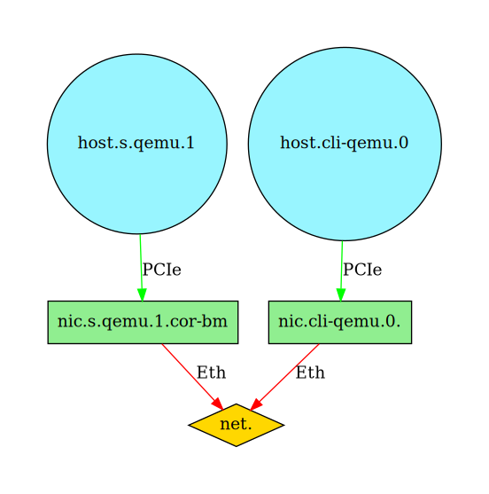
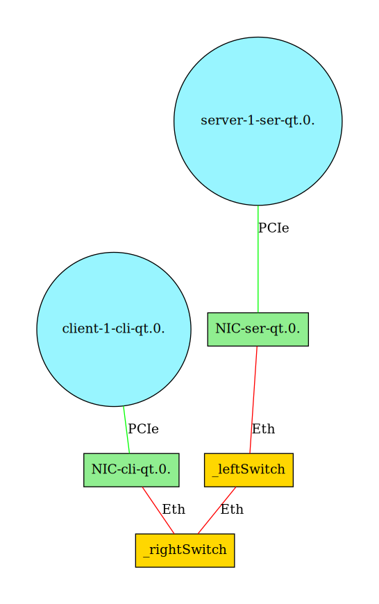
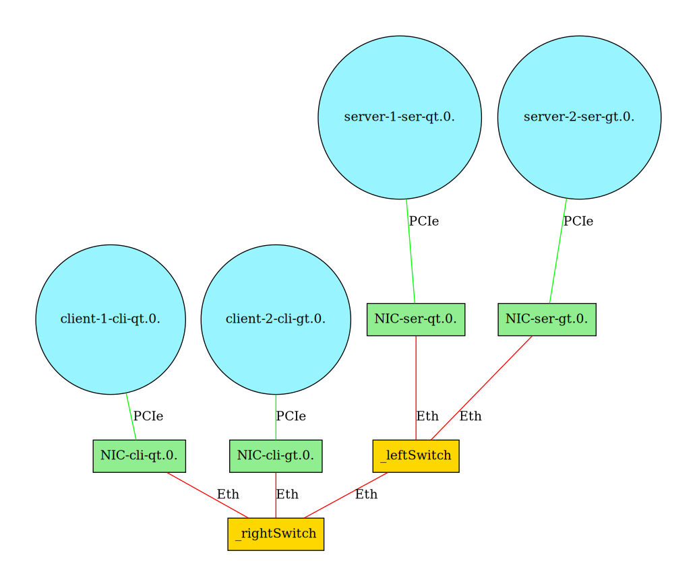
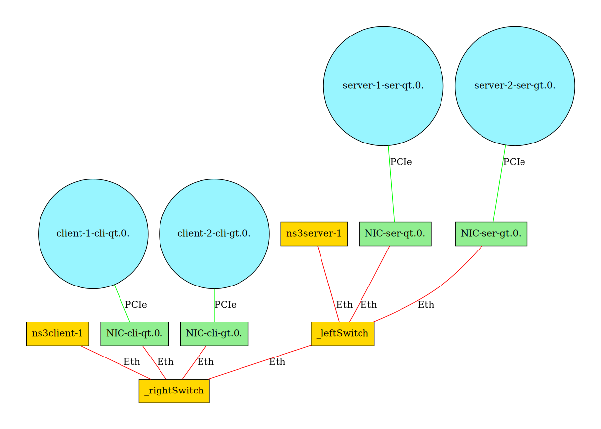

## Simbricks Orchestration Example: Network Topologies

### Overview
This Simbricks example demonstrates how to leverage the orchestration framework to simulate increasingly complex network topologies. We start with a basic client-server setup connected by a switch and gradually extend it through three further milestones:

1. **Single Client-Server Pair with Switch:** A foundational setup to establish the basic components.
2. **Dumbbell Topology:** Introduces a more complex topology replacing the switch.
3. **Multiple Client-Server Pairs:** Demonstrates handling different client-server types.
4. **Background Traffic:** Simulates realistic network conditions with less detailed host applications.

During these milestones building upon the experiment script from milestone 1, additional complexity is added to the experiment throughout all following milestones by making slight changes to the python definition of the experiment, thus showing how the SimBricks orchestration framework can be used effectively.

### Milestone 1: Single Client-Server Pair with Switch
A simple topology consisting of a client, server, and a switch. This milestone serves as a starting point for the upcoming milestones. In this initial experiment setup, we will see how the SimBricks orchestration framework can be used to create a very simple experiment:

A single client will run netperf and communicate to a server running netserver. Client and server will each be connected to NIC which are connected by a simple switch. Client and server will be simulated using QEMU whereas the NICs are simualted with SimBricks-Corundum behavioral model and the switch will be simulated with SimBricks-switch network simulator.

Simulated topology:


### Milestone 2: Dumbbell Topology
Replaces the switch with a dumbbell topology. In this second milestone we build upon the first milestone and replace SimBricks-switch network by a network consisting of two switches that connected by a bottleneck link. This network will be simulated in the ns3 simulator.

Simulated topology:



### Milestone 3: Multiple Client-Server Pairs
Building upon milestone 2, we will introduce multiple client-server pairs that are simulated using different simulators into the experiment thus creating a larger topology that comprises more than two single hosts. 

Simulated topology:


### Milestone 4: Background Traffic
Adds less detailed host applications to generate background traffic. In milestone 3 we added the ability to simulated multiple hosts detailed, i.e. runniong linux and netperf similar to milestone 1. In this milestone, however, we will introduce a way to simulate hosts or applications that send packets over the topologies bottleneck link inside the ns3 simulator. 

Simulated topology:


### Running the experiments
The different milestone-experiments can be run by invoking the following commands respectively:
```bash
simbricks-run --force --verbose milestone-1/demo_1_a.py
simbricks-run --force --verbose milestone-2/demo.py
simbricks-run --force --verbose milestone-3/demo.py
simbricks-run --force --verbose milestone-4/demo.py
```