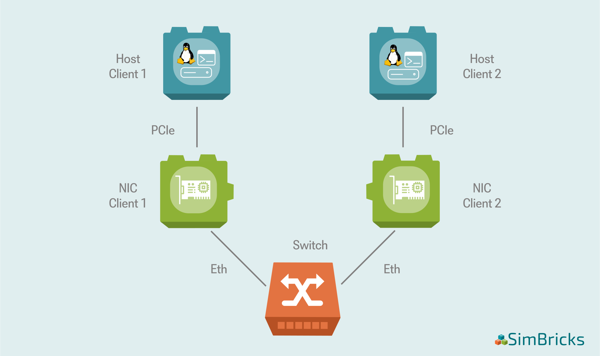
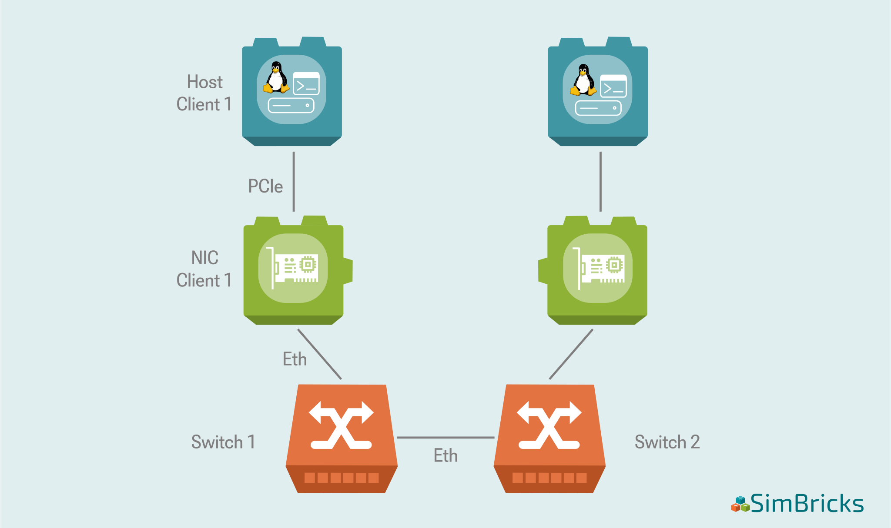
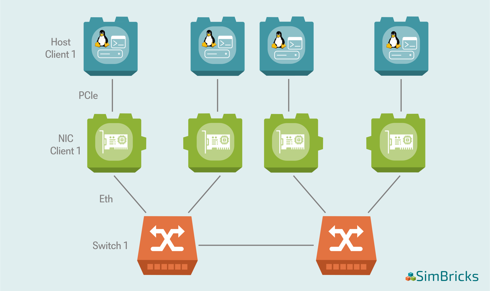
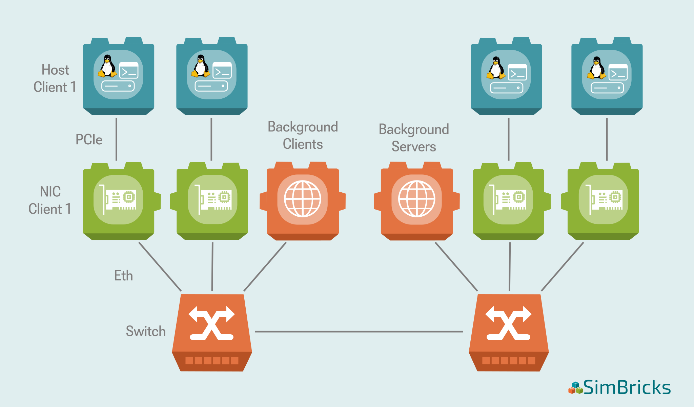

## Simbricks Orchestration Example: Network Topologies

### Overview
This Simbricks example demonstrates how to leverage the orchestration framework to simulate increasingly complex network topologies. We start with a basic client-server setup connected by a switch and gradually extend it through three further milestones:

1. **Single Client-Server Pair with Switch:** A foundational setup to establish the basic components.
2. **Dumbbell Topology:** Introduces a more complex topology replacing the switch.
3. **Multiple Client-Server Pairs:** Demonstrates handling different client-server types.
4. **Background Traffic:** Simulates realistic network conditions with less detailed host applications.

During these milestones building upon the experiment script from milestone 1, additional complexity is added to the experiment throughout all following milestones by making slight changes to the python definition of the experiment, thus showing how the SimBricks orchestration framework can be used effectively.

### Corundum NIC

We use the [Corundum open-source NIC](https://github.com/corundum/corundum) across all milestones. During the first milestone we utilize a [behavioral C++ model](https://github.com/simbricks/simbricks/tree/main/sims/nic/corundum_bm) of the Corundum NIC that is provided by SimBricks. In the milestones 2,3, and 4 we then switch to the RTL simulation using Verilator. In Order to do so, SimBricks provides an [Adapter and Wrapper](https://github.com/simbricks/simbricks/blob/main/sims/nic/corundum/corundum_verilator.cc) around Verilator.
The Simbricks orchestration framework facilitates seamless transitions between the behavioral model and the unmodified FPGA RTL simulated using Verilator. For that purpose, SimBricks provides python classes in its orchestraition framework that are wrap the [behavioral model](https://github.com/simbricks/simbricks/blob/0373937031dc5adba6a65860649035e80939f38a/experiments/simbricks/orchestration/simulators.py#L753C1-L756C67) and the [RTL model](https://github.com/simbricks/simbricks/blob/0373937031dc5adba6a65860649035e80939f38a/experiments/simbricks/orchestration/simulators.py#L737C1-L750C10).

To use the NIC alongside hosts that run unmodified Linux, we provide the [cordundum Linux driver](https://github.com/simbricks/simbricks/tree/main/images/mqnic) and provide it as kernel modul to Linux when simulating a host. For that purpose the SimBricks orchestraition framework provides a [`NodeConfig`](https://github.com/simbricks/simbricks/blob/0373937031dc5adba6a65860649035e80939f38a/experiments/simbricks/orchestration/nodeconfig.py#L223C1-L232C50) that allows a host simulator to mount the required kernel module and load it on startup.

### Milestone 1: Single Client-Server Pair with Switch
A simple topology consisting of a client, server, and a switch. This milestone serves as a starting point for the upcoming milestones. In this initial experiment setup, we will see how the SimBricks orchestration framework can be used to create a very simple experiment:

A single client will run netperf and communicate to a server running netserver. Client and server will each be connected to NIC which are connected by a simple switch. Client and server will be simulated using QEMU whereas the NICs are simualted with SimBricks-Corundum behavioral model and the switch will be simulated with SimBricks-switch network simulator.



### Milestone 2: Dumbbell Topology
Replaces the switch with a dumbbell topology. In this second milestone we build upon the first milestone and replace SimBricks-switch network by a network consisting of two switches which are connected by a bottleneck link. This network will be simulated in the ns3 simulator.

Note that from this milestone on we use the RTL simulation to simulate the NICs using Verilator.




### Milestone 3: Multiple Client-Server Pairs
Building upon milestone 2, we will introduce multiple client-server pairs that are simulated using different simulators into the experiment thus creating a larger topology that comprises more than two single hosts. 



### Milestone 4: Background Traffic
Adds less detailed host applications to generate background traffic. In milestone 3 we added the ability to simulated multiple hosts detailed, i.e. runniong linux and netperf similar to milestone 1. In this milestone, however, we will introduce a way to simulate hosts or applications that send packets over the topologies bottleneck link inside the ns3 simulator. 



### Milestone 5: Distributed Execution
We extend the Instantiation Configuration in the experiment script to create multiple execution Fragments. 
One that executes the network (i.e. the red components in aboves schematic representation), one that executes one half of the hosts and NICs and another Fragment that executes the other half of hosts and NICs.

### Running the experiments
The different milestone-experiments can be run by running the following command:
```bash
simbricks-cli submit --follow milestone-<number>.py
```

In case shown above replace `<number>` by the mielstone you're inetrested in, i.e. either 1,2,3 or 4.

To learn more on how to execute SimBricks virtual prototypes reach out to us directly or check out our [documentation](https://simbricks.readthedocs.io/en/latest/).